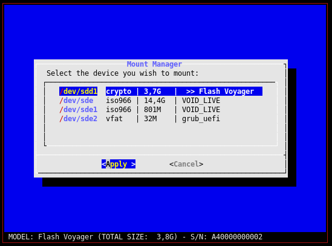
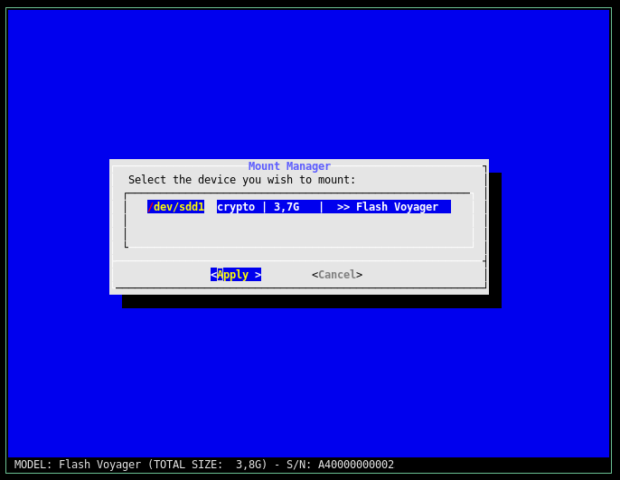

# NCMOUNT

ncmount is an ncurses-based tool to mount and unmount devices on Linux. It handles devices encrypted with LUKS. It targets users who favor command line and do not use automount programs.

## Installation and dependencies

This program relies on :
* `bash`
* `lsblk`, generally shipped with `util-linux` package
* `dialog`

You can test this program without installing, but the best way to use this program is to install it by creating a package for your distribution.


## Basic usage

Run `ncmount -h` to display help.

```
ncmount v0.3 (january 2016) - Ncurse Mount Manager

If no option is specified, ncmount will show all unmounted devices,
and allow the user to mount one device.

Options:
    -h, -?   help: display this helps and exit
    -v       version: display version and exit
    -u       umount: show only mounted devices, and umount the selected device
    -r       removable: show only removable devices (do not show sata devices)
    -p       permanent: show only permanent devices (do not show USB devices)
    -n       dry run: only echo what should be done
    -d       debug: shows mounted AND unmounted device (even with -u), and do not mount or unmount anything
```

The program will show the list of partitions that match the command-line option. Typical screenshot:



The output contains the following fields:
* Column 1: device node name
* Column 2: filesystem type
* Column 3: size of the partition
* Column 4: partition filesystem label (or device model if label is not available)

The status line at the bottom of the screen also shows information about the device (not the partition): model, total size, and serial number.

These informations allow the user to identify each partition and chose which one to mount (or unmount).

Because the data about the devices and partitions is obtained through `lsblk`, `ncmount` must be run as root even in debug or dry-run mode.


## Commun usage

The most commun usage of ncmount is to mount and unmount removable media.

### Mount a removable media 

To display the list of unmounted removable media and select a media to mount, use:
``` 
# must be run as root:
ncmount -r
```

This command will show the partitions of all connected removable media. The following screenshot shows the case of a USB stick containing a single encrypted partition:



If the partition is encrypted, a password prompt will appear.


### Unmount a removable media 

To display the list of mounted removable media and select a media to unmount, use

``` 
# must be run as root:
ncmount -u
```

## Recommanded aliases - run as regular user and change directory

When using this program daily, the user may want:
* to use ncmount without logging as root
* to enter the mount point directory just after mounting a partition (by automatically changing the current directory)

This is made possible with simple aliases, to be added in `.bashrc`:

```
alias mm='dir="`sudo ncmount -r | grep "^Device mounted on" | awk  '\''{print \$NF}'\'' `" && [ -n "$dir" ] && echo "cd $dir" && cd "$dir"'
alias um='sudo ncmount -ru'
```

With these aliases:
* typing the command `mm` (for Mount Manager) will show unmounted removable media partition and allow to mount a partition ; the terminal will then change its current directory to the partition mount point
* typing the command `um` (for UnMount) will show mounted removable media partition and allow to unmount a partition 


Of course, for these aliases to work and be convenient, `sudo` must be configured to allow the current user to run `ncmount` without having to type a password. This is typically done (depending on your linux distribution) by adding a file similar to this in /etc/sudoers.d:

```
# Content of /etc/sudoers.d/ncmount
Defaults    insults
myusername ALL = NOPASSWD: /usr/bin/ncmount
```

Make sure to leave the partition mount point directory before unmounting (otherwise the partition will be reported as busy).


## Alternatives

This program is similar to [bashmount](https://github.com/jamielinux/bashmount), but `ncmount` uses an ncurses interface.
